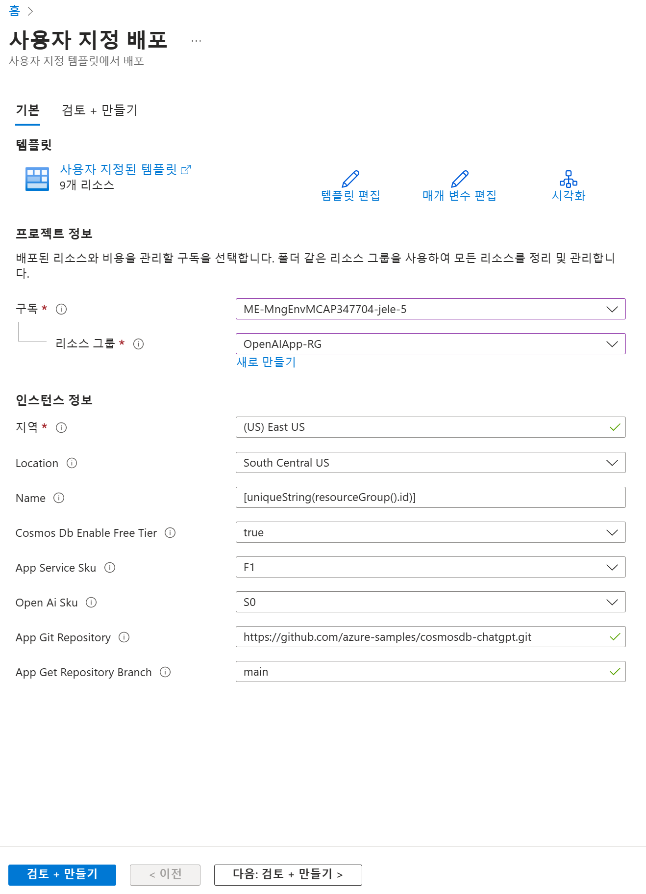
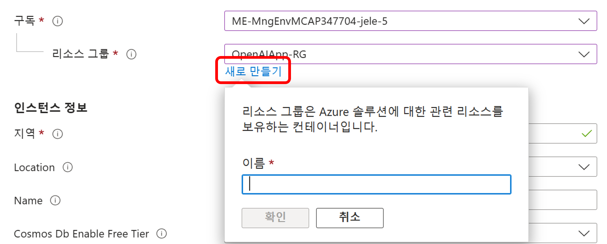
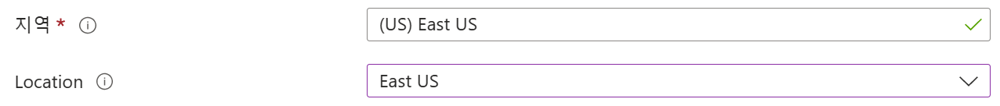
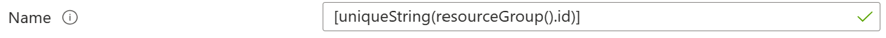
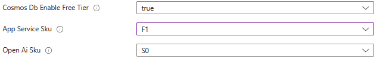
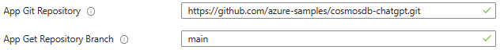
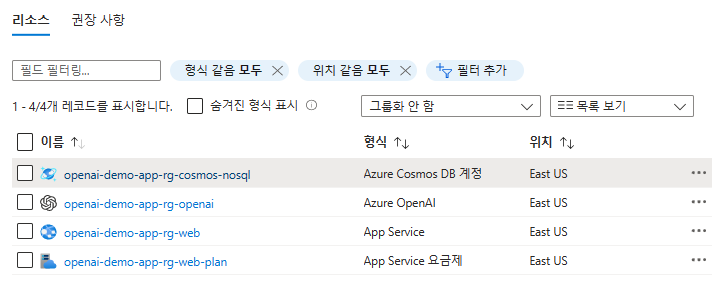
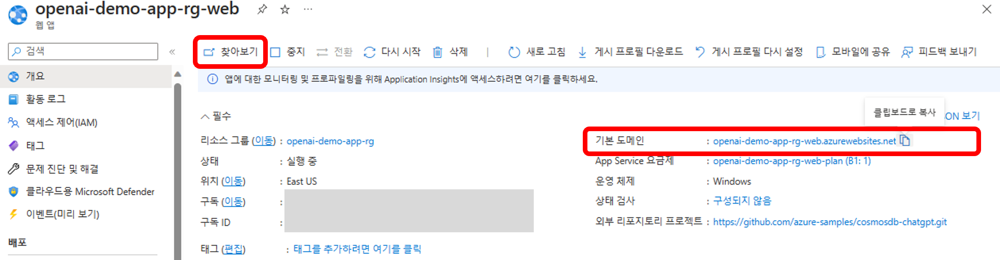
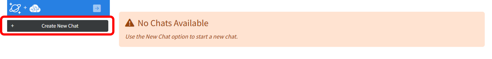

# Intelligent Apps HOL with CosmosDB and ChatGPT

## Step 1. Azure에서 ChatBot App 리소스 배포 

1. 아래 Deploy to Azure 버튼을 클릭하여 Bicep 스크립트를 이용하여 리소스를 배포합니다. 

> 

2. 위의 Deploy to Azure 버튼을 클릭하면 아래의 "사용자 지정 배포"이 나옵니다. 필요한 내용을 차례차례 입력하고 리소스 만들기를 해보겠습니다.

> 

3. 화면의 아래 항목에서 구독과 리소스 그룹을 선택합니다. Azure OpenAI Access 권한을 받은 구속을 선택합니다. 리소스 그룹은 새로 만들어도 되고, 기존에 있는 것을 선택해도 됩니다. 리소스 그룹을 새로 만들 경우, 리소스 그룹 이름 (예: OpenAPIApp-RG)을 입력하고, 위치를 선택합니다.

> 

4. 화면의 아래 항목에서 지역과 Location을 선택합니다. 지역은 Azure App Service를 배포할 지역을 선택합니다. Location은 Azure OpenAI Access 권한을 받은 지역 (예: East US)을 선택합니다.

> 

5. 화면의 아래 항목에서 채팅 애플리케이션의 고유 이름을 입력합니다. 기본값으로는 자동 생성된 고유 문자와 리소스 그룹명을 사용합니다. 이 이름은 Azure Cosmos DB, Azure App Service, Azure OpenAI 리소스의 이름에 prefix로 사용됩니다.

> 

6. 화면의 아래 항목에서 Cosmos DB Tier, App Service SKU, OpenAI SKU를 선택합니다. 기본값으로는 Cosmos DB Tier는 "Free", App Service SKU는 "F1", OpenAI SKU는 "S0"을 사용합니다.

> 

7. 화면의 아래 항목에서 App Git Repository와 App Git Repository Branch를 선택합니다. 기본값으로는 "Azure-Samples/cosmosdb-chatgpt"와 "main"을 사용합니다. 

> 

8. [다음: 검토 + 만들기]를 클릭하여 유효성 검사를 하고, [만들기]를 클릭하여 리소스를 생성합니다. 리소스 생성이 완료되면 아래와 같이 4개의 서비스를 배포하게 됩니다.

> 

  * Azure Cosmos DB 계정 (데이터베이스와 400 RU/s 컨테이너) - 채팅 기록을 저장. 데이터베이스와 컨테이너는 400 RU/s로 생성합니다. 이는 옵션으로 Cosmos DB 무료 티어로 구성할 수 있습니다.
  * Azure App Service - 웹사이트를 호스팅 합니다.
  * Azure App Service Plan - App Service를 호스팅할 수 있는 서버. 무료 티어로 구성할 수 있습니다.
  * Azure OpenAI 계정 - Azure App Service에서 구동되는 애플리테이션에서 사용할 "text-davinci-003" 모델의 배포에 대한 이름을 지정해야 합니다.
  * [Note] Azure Cosmos DB와 OpenAI 연결 정보는 zero-touch로 구성되어 있으며, 배포 시점에 Azure App Service 인스턴스의 환경 변수에 삽입됩니다.

9. Chatbot 애플리케이션이 정상적으로 배포되었는지 확인합니다. 배포된 리소스중에 App Service를 선택하여, 아래의 "찾아보기"를 선택하거나 "기본도메인"에 있는 URL을 복사하여 새로운 브라우저 탭에서 엽니다.

> 

10. 브라우저의 새로운 탭에서 채팅 애플리케이션이 정상적으로 동작하는지 확인합니다. 아래의 "Create New Chat"을 클릭하여 새로운 채팅을 생성할 수 있습니다.

> 

## 실습 순서

* [Step 1. Azure에서 ChatBot App 리소스 배포](https://github.com/jeongaelee/ChatbotAppHOL/blob/master/step01.md)
* [Step 2. OpenAPI Key 확인 및 Azure OpenAI 서비스 API 연결 확인](https://github.com/jeongaelee/ChatbotAppHOL/blob/master/step02.md)
* [Step 3. Chatbot 앱 보안](https://github.com/jeongaelee/ChatbotAppHOL/blob/master/step03.md)
