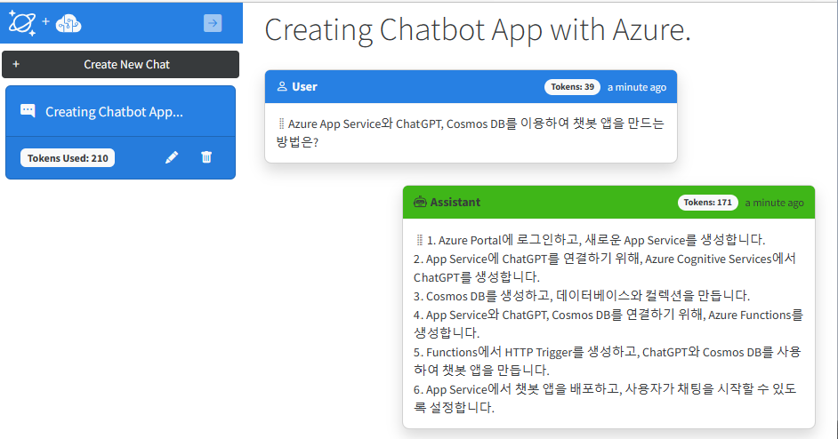

# Azure Intelligent Apps with CosmosDB and ChatGPT HOL

## Hands-on Lab 소개

* 본 실습에서는 Azure App Service와 CosmosDB, Azure OpenAI 서비스를 이용하여 지능형 웹 애플리케이션을 생성합니다. 이 실습을 완성하고나면, Azure OpenAI 서비스를 이용하여 AI 챗봇 애플리케이션을 생성하는 방법을 습득할 수 있습니다.

* OpenAI와 ChatGPT
  * OpenAI는 2015년 설립된 인공지능 연구 기업입니다. OpenAI는 인공지능의 발전을 위해 노력하고 있으며, 인공지능의 발전을 통하여 인류의 미래를 개선하고자 합니다. OpenAI는 인공지능의 발전을 위하여 다양한 연구를 진행하고 있으며, 그 중 하나가 ChatGPT입니다.
  * ChatGPT는 OpenAI에서 개발한 인공지능 챗봇입니다. ChatGPT는 인공지능이 자연어를 이해하고, 자연어로 대화를 주고받을 수 있도록 학습된 인공지능입니다.
  * 본 실습에서는 선택된 GPT 모델을 이용하여 수준 높은 답변과 복잡한 질문에 대한 답변을 생성하는 방법을 학습합니다.

## Intelligent Apps Contoso Chatbot 소개

* 본 샘플 애플리케이션은 GitHub Azure-Samples 리파지토리의 ["Azure CosmosDB + OpenAI ChatGPT"](https://github.com/Azure-Samples/cosmosdb-chatgpt)을 기반으로 배포 됩니다. 

> 

### 기능

* 본 채팅 애플리케이션은 개별적인 챗 세션을 왼쪽에서 생성하여 선택할 수 있습니다. 각 세션에서 GPT 모델이 대화를 하는 것처럼 응답할 수 있는 컨텍스트를 제공합니다.

* 본 샘플에서는 "gpt-35-turbo" 모델이 사용되는데, 이 모델은 최대 4096 토큰을 가집니다. 토큰은 서비스의 요청과 응답에 모두 사용됩니다. appsettings.json 파일의 maxConversationTokens의 값을 최대 토큰값에 가깝게 설정하면, 요청할때 토큰이 모두 사용될 경우 응답이 없어나 거의 포함되지 않을 수 있습니다. 

* 각 대화 세션에 대한 모든 프롬프트 및 완료 내역은 Azure Cosmos DB에 저장됩니다. UI에서 대화 세션을 삭제하면 해당 데이터도 삭제됩니다.

* 애플리케이션은 GPT 모델에게 첫 번째 프롬프트의 한 두 단어 요약을 제공하도록 요청하여 채팅 세션의 이름을 요약합니다. 이렇게 하면 다른 채팅 세션을 쉽게 식별할 수 있습니다.

* 노트: 이것은 샘플 애플리케이션으로 Azure App Service, Azure Cosmos DB 및 Azure OpenAI Service를 함께 사용하는 방법을 시연하기 위한 것입니다. 본 제품은 프로덕션이나 대규모 사용을 위한 것이 아닙니다.

## 사용 리소스 및 환경
  * Azure App Service
  * Azure CosmosDB
  * Azure OpenAPI

## High Level Architecture
> 

  * Chatbot 사용자 인터페이스는 Blazor front end로 구동되어 Azure App Service에 호스팅됩니다. (Blazor는 .NET Core 기반의 웹 프레임워크로, C#을 사용하여 웹 프론트 엔드를 구현할 수 있습니다.) 기본적으로 Azure OpenAI 서비스는 서비스의 URI와 API Key를 통하여 인증됩니다. 사용자가 채팅을 시작할때, 프롬프트가 OpenAI 서비스로 전송되고, 응답이 AI 서비스에서 반환됩니다. 그런 다음 모든 메세지가 Azure Cosmos DB에 저장되고 지속됩니다.

  * 본 시나리오를 지원하기 위하여, Azure App Service에 호스팅되는 웹앱은 아래의 서비스들과 연동됩니다.

    1. Azure AD: 고객 인증
    2. Azure OpenAI Service: 자연어 ChatGPT 모델로 부터 AI 응답 생성
    3. Azure CosmosDB: Intelligent App에서 사용된 ChatGPT 모델로 부터 생성된 응답 저장

## 사전 요구 사항

* 지능형 웹 애플리케이션 배포를 위해서는 다음의 사전 요구 사항이 필요합니다.

1. Azure 구독 및 Azure OpenAPI Access

  * Azure OpenAPI Access 요청은 [본 링크](https://customervoice.microsoft.com/Pages/ResponsePage.aspx?id=v4j5cvGGr0GRqy180BHbR7en2Ais5pxKtso_Pz4b1_xUOFA5Qk1UWDRBMjg0WFhPMkIzTzhKQ1dWNyQlQCN0PWcu)에서 정보를 채우고 Submit 하면 됩니다.
  * Azure OpenAPI Access 요청이 승인/거절되면 이메일로 알려줍니다.

2. Azure 구독에서 App Serivce와 CosmosDB를 배포할 수 있는 권한.

3. Visual Studio, Visual Studio Code등의 코드를 보거나 수정할 수 있는 에디터

## 실습 순서

* [Step 1. Azure에서 ChatBot App 리소스 배포](https://github.com/jeongaelee/ChatbotAppHOL/blob/master/step01.md)
* [Step 2. OpenAPI Key 확인 및 Azure OpenAI 서비스 API 연결 확인](https://github.com/jeongaelee/ChatbotAppHOL/blob/master/step02.md)
* [Step 3. Chatbot 앱 보안](https://github.com/jeongaelee/ChatbotAppHOL/blob/master/step03.md)
