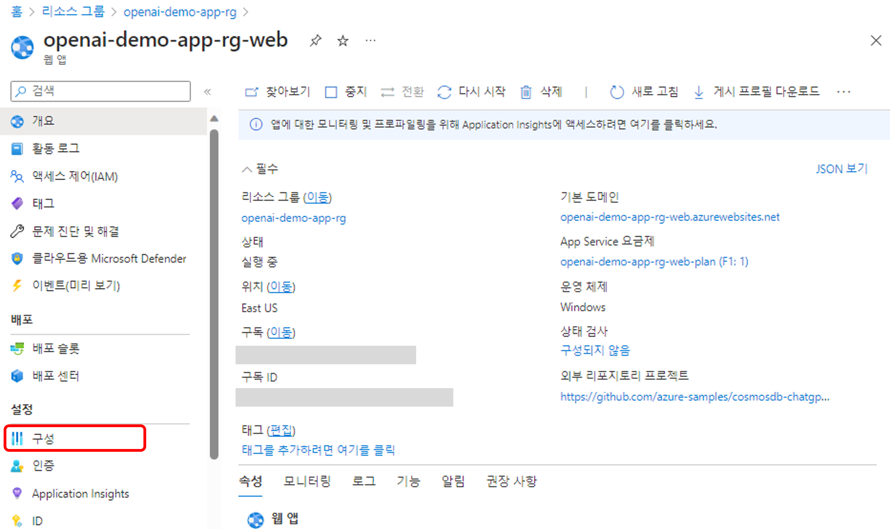
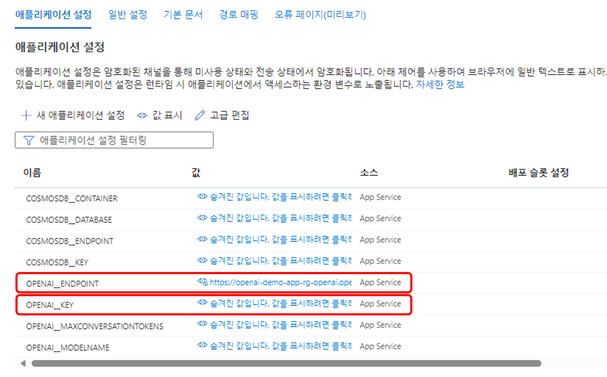
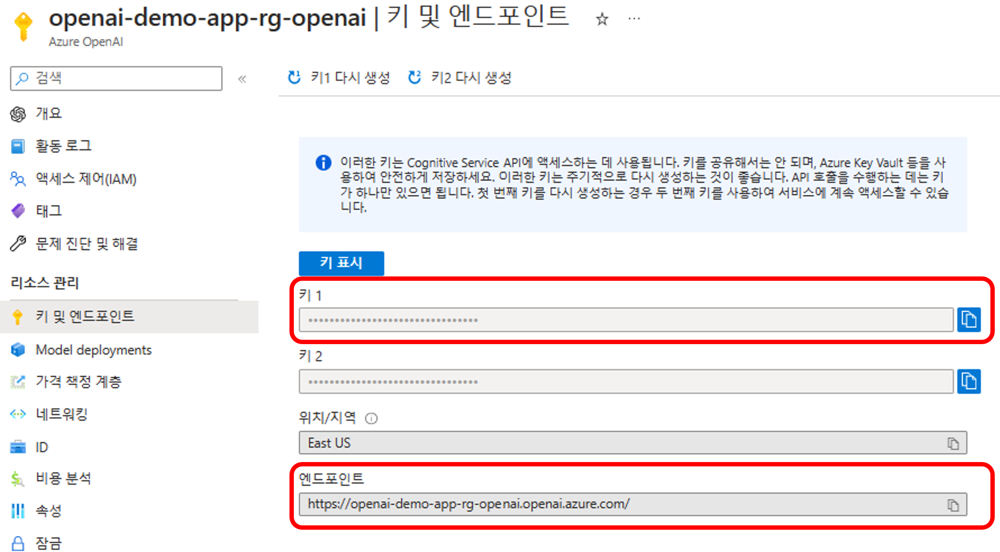
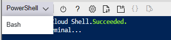
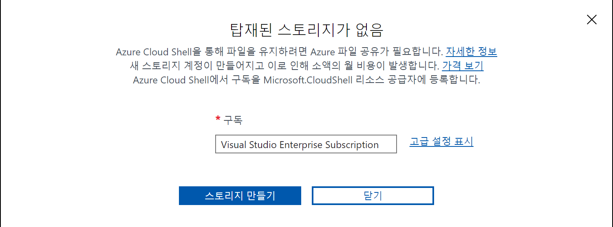
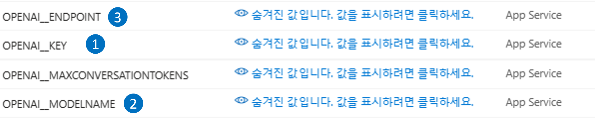
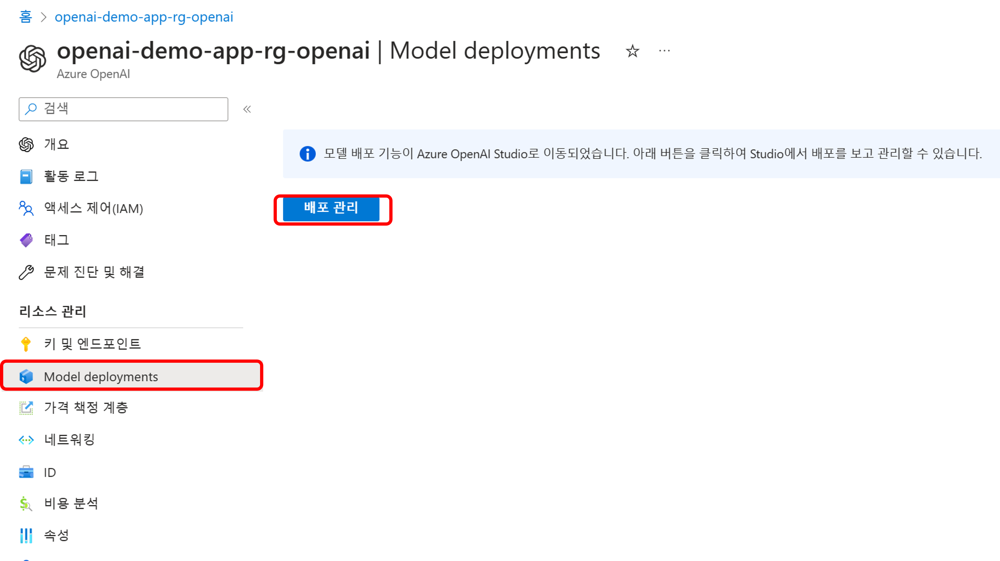
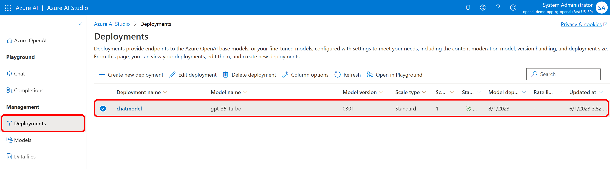

# Intelligent Apps HOL with CosmosDB and ChatGPT

## Step 2. OpenAI Key 확인 및 Azure OpenAI 서비스 API 연결 확인

* Step 1에서 Azure OpenAI 서비스와 연동한 Contoso Chatbot 앱을 성공적으로 배포하였습니다. 이제 OpenAI 서비스를 사용하기 위해 OpenAI Key를 확인하고, Azure OpenAI 서비스 API 연결을 확인해보겠습니다.

### OpenAI Key 확인

1. Azure Portal에서 App Service를 찾아 설정>구성 메뉴를 선택합니다.

> 

2. 구성 메뉴에서는 App Service에 배포된 애플리케이션에서 사용하는 설정값들이 저장됩니다. Cosmos DB와 OpenAI의 키와 URI 값들이 본 메뉴에 설정되어있는 것을 보실 수 있습니다.

> 

3. 본 구성 메뉴의 셋팅들은 챗봇이 Azure OpenAI 서비스의 AI 기능을 사용하기 위하여 연결하는 중요한 값입니다. 이 값들은 배포 스크립트를 통하여 리소스를 배포할때 자동으로 생섣된 값으로, 챗봇 애플리케이션의 코드에서 사용됩니다. 이 값들을 변경하면 챗봇 애플리케이션의 동작이 변경될 수 있습니다. 이 값들을 변경하고 싶으시면, 본 구성 메뉴에서 변경하시면 됩니다. 

4. 다음으로, Azure OpenAI 리소스에서 OpenAI Key를 확인해보겠습니다. Azure Portal에서 배포된 Azure OpenAI 리소스를 찾아서, "키 및 엔드포인트" 메뉴를 선택합니다. 본 메뉴에서 보이는 키 1과 엔드포인트 값이 챗봇 애플리케이션에서 사용되는 OpenAI Key와 엔드포인트 값입니다.

> 

5. Azure OpenAI 서비스를 연동하는 코드를 탐색하고 싶으시면, GitHub Repository 원본에 있는 [\Services\OpenAiService.cs](https://github.com/Azure-Samples/cosmosdb-chatgpt/blob/main/Services/OpenAiService.cs) 파일을 참조하시면 됩니다.

### Azure OpenAI 서비스 API 연결 확인

1. Azure OpenAI 서비스 API의 연결을 테스트하기 위하여 위의 OpenAI Key 확인 단계에서 확인한 엔드포인트 값을 준비합니다.

2. Azure Portal의 Cloud Shell을 실행합니다. Cloud Shell은 Azure Portal의 우측 상단에 위치한 아이콘을 클릭하면 실행할 수 있습니다.

> 

3. Cloud Shell이 실행되면, 아래와 같이 PowerShell을 선택합니다. 

> 

   Cloud Shell을 처음 실행하면, Azure Cloud Shell 환경을 구성하기 위하여 스토리지 생성이 필요합니다. 스토리지 생성을 위한 메시지가 나타나면, "스토리지 만들기"를 선택합니다.

> 

4. 아래의 curl 명령어를 실행합니다. 위의 OpenAI Key 확인의 2단계에서 확인한 1) YOUR_ENDPOINT_NAME, 2) YOUR_MODEL_DEPLOYMENT_NAME, 3) YOUR_API_KEY 값으로 교체하여 실행합니다.

> 

  ```
  curl [YOUR_ENDPOINT_NAME]/openai/deployments/[YOUR_MODEL_DEPLOYMENT_NAME]/completions?api-version=2022-12-01 -H "Content-Type: application/json" -H "api-key: [YOUR_API_KEY]" -d '{ "prompt": "Once upon a time", "max_tokens": 5}'
  ```

* OpenAI 서비스가 성공적으로 배포 된 후에 위의 curl 명령어를 실행하면, 아래와 같이 완성된 문장의 OpenAI 서비스 API의 응답을 확인할 수 있습니다.

  ```
  {"id":"cmpl-7NyLdrOPlk3Sww3PCZYIVLs######","object":"text_completion","created":1685947877,"model":"gpt-35-turbo","choices":[{"text":", in a village in","index":0,"finish_reason":"length","logprobs":null}],"usage":{"completion_tokens":5,"prompt_tokens":4,"total_tokens":9}}
  ```
### Azure OpenAI 서비스 배포 모델 확인

1. Azure Portal의 Azure OpenAI 리소스를 찾아서, "Model Deployments" 메뉴를 선택합니다. "배포 관리"를 선택하면 Azure AI Studio로 리디렉션 되면서 Azure OpenAI 서비스에 배포된 모델들을 확인할 수 있습니다.

> 

2. Azure AI Studio의 "Management > Deployments" 메뉴에서 배포된 모델을 확인 할 수 있습니다.

> 

## 실습 순서

* [Step 1. Azure에서 ChatBot App 리소스 배포](https://github.com/jeongaelee/ChatbotAppHOL/blob/master/step01.md)
* [Step 2. OpenAI Key 확인 및 Azure OpenAI 서비스 API 연결 확인](https://github.com/jeongaelee/ChatbotAppHOL/blob/master/step02.md)
* [Step 3. Chatbot 앱 보안](https://github.com/jeongaelee/ChatbotAppHOL/blob/master/step03.md)
