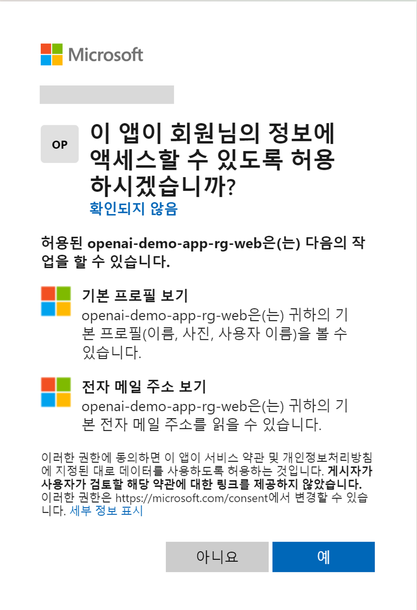

# Intelligent Apps HOL with CosmosDB and ChatGPT

## Step 3. Chatbot 앱 보안

* 앞의 단계에서 배포된 애플리이션은 공개적으로 접속할 수 있는 URL이 있으며, 이 URL을 통해 누구나 Chatbot에 접속할 수 있는 상태입니다. 이를 방지하기 위하여 애플리케이션에 대한 액세스를 제한하기 위하여 로그인으로 사용자를 검증하고 권한을 부여할 수 있습니다. SaaS 애플리케이션을 만들때 유료 사용자가 가입을 하고 액세스를 할 수 있도록 만드는 것은 일반적인 앱 로그인의 구현 방법입니다.

* 사용자 인증 및 권한 부여를 포함하도록 애플리케이션을 업데이트하려면, 사용자가 엔터프라이즈 애플리케이션의 소유자이거나 글로벌 관리자, 애플리케이션 관리자 혹은 클라우드 관리자 역할 중 하나를 할당 받아야 합니다. 이번 단계에서는 Azure Active Directory를 통하여 사용자를 검증하고 권한을 부여하는 방법을 알아보겠습니다.

1. Azure Portal에서 App Service를 찾아 "인증" 메뉴를 선택합니다.

> 

2. "인증" 메뉴에서 "ID 공급자 추가"를 클릭합니다. ID 공급자는 사용자가 로그인할 수 있는 ID를 제공하는 서비스로, 마이크로소프트, 페이스북, 구글, 트위터, GitHub, Apple, OpenID Connect가 있습니다. 이번 단계에서는 Microsoft 계정을 사용하여 로그인할 수 있도록 설정합니다.

> 

3. ID 공급자 선택 항목에서 "Microsoft"를 선택합니다.

> 

4. ID 공급자 추가를 위하여 아래와 같이 설정합니다. 먼저, 테넌트 유형을 "인력"을 선택합니다. (테넌트 유형에 대한 자세한 정보를 보려면 [여기](https://learn.microsoft.com/ko-kr/azure/active-directory/develop/quickstart-create-new-tenant)를 참조하세요.) 

> 

5. 앱 등록에 필요한 항목들을 아래와 같이 입력합니다. 

* 앱 등록 유형: "새 앱 등록 만들기"를 선택합니다.
* 이름: 사용자에게 표시되는 애플리케이션의 표시 이름입니다. 이 이름은 Azure AD 앱 등록 환경을 사용하여 나중에 변경할 수 있습니다.
* 지원되는 계정 유형: "모든 Azure AD 디렉터리 및 개인 Microsoft 계정"을 선택합니다. 회사 또는 학교 계정이나 개인 Microsofot 계정이 있는 모든 사용자가 애플리케이션에 접속할 수 있습니다. 

> 

6. App Service 인증 설정 항목들을 아래와 같이 설정합니다. 항목에 해당 값들을 입력 한 후에 "다음: 권한 >" 버튼을 클릭합니다.

* 액세스 권한: 인증 필요
* 인증되지 않은 요청: HTTP 302 리디렉션 찾음: 웹 사이트에 권장됨
* 토큰 저장소: 선택

> 

7. Microsoft Graph 권한을 설정하여, 앱 사용자가 처음으로 로그인 때 동의를 요청하는 권한을 추가합니다. 기본으로 User.Read 권한이 추가되어있습니다. User.Read 권한은 앱의 일반적인 기능을 위하여 요구되는 권한으로, 사용자가 애플리케이션에 로그인 하는 것을 허락하고 애플리케이션이 사용자의 프로필을 읽을 수 있도록 합니다. 또한, 애플리케이션이 로그인한 사용자의 기본적인 회사 정보를 읽을 수 있습니다.

> 

8. "추가" 버튼을 클릭합니다. ID 공급자 추가가 완료되면, 아래와 같이 인증 설정 및 ID 공급자가 추가된 것을 확인하실 수 있습니다. 

> 

9. 챗봇 애플리이션의 접근 권한이 업데이트 되어 Azure AD에 의해서 보호되고 있습니다. 챗봇 애플리케이션에 접속하여 로그인을 시도하면, 아래와 같이 로그인 화면이 나타납니다.

> 

10. 처음 로그인을 할때 아래와 같이 권한을 허용하여야 웹 사이트에 접속할 수 있습니다.

> 

## 실습 순서

* [Step 1. Azure에서 ChatBot App 리소스 배포](https://github.com/jeongaelee/ChatbotAppHOL/blob/master/step01.md)
* [Step 2. OpenAPI Key 확인 및 Azure OpenAI 서비스 API 연결 확인](https://github.com/jeongaelee/ChatbotAppHOL/blob/master/step02.md)
* [Step 3. Chatbot 앱 보안](https://github.com/jeongaelee/ChatbotAppHOL/blob/master/step03.md)
